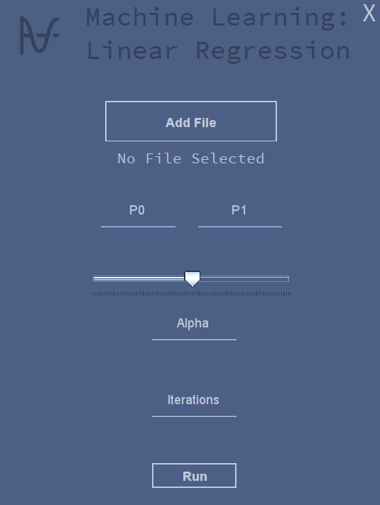
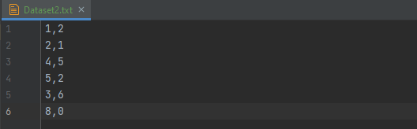
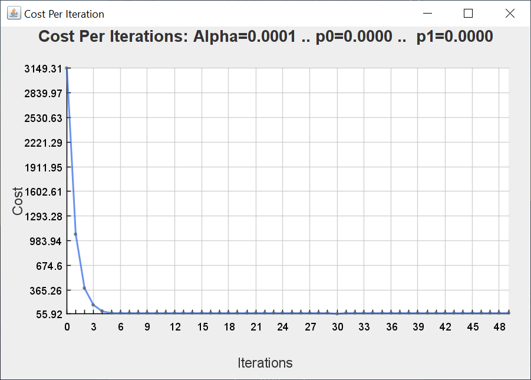
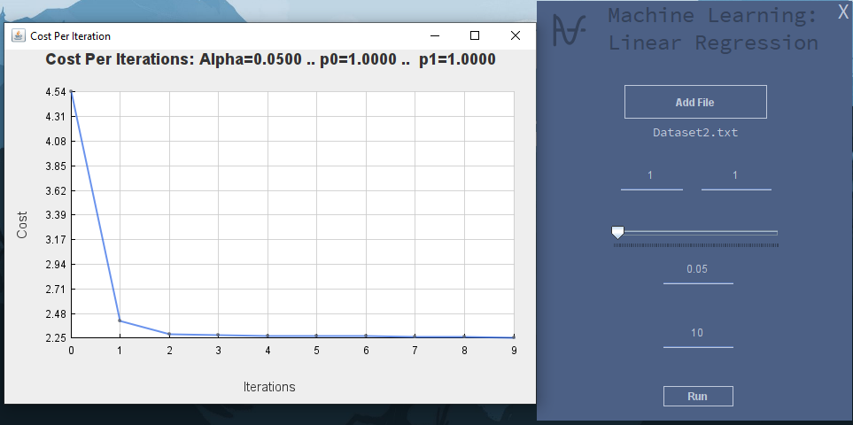
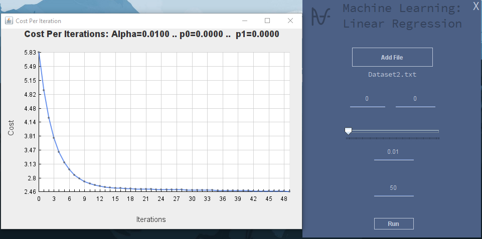
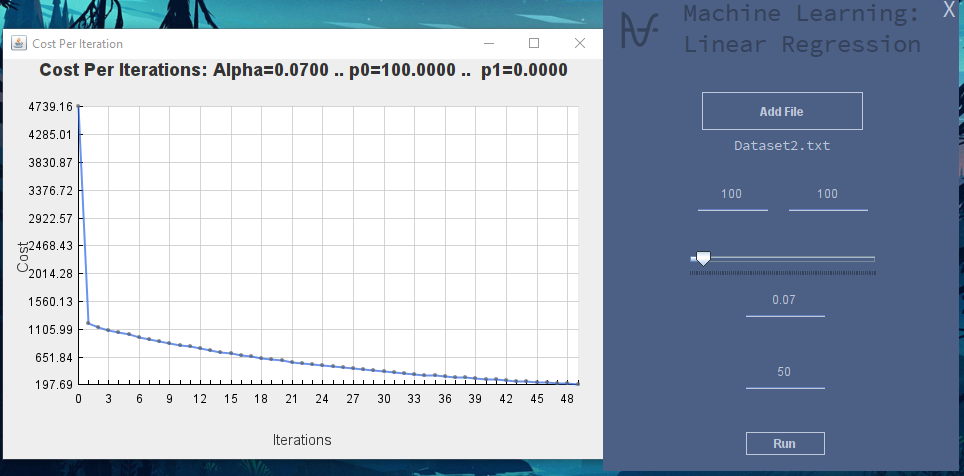
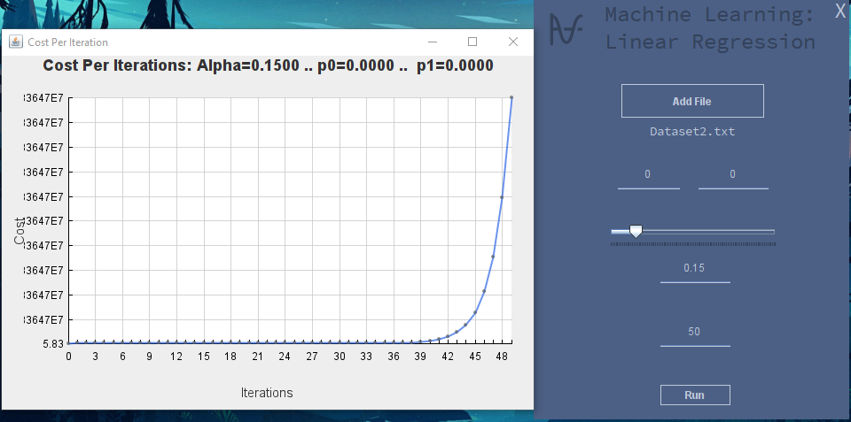

# ML_LinearRegression

Yoo ! **Oknaa** here
 
This is a program that applies the Linear Regression algorithm to a DataSet.
 

### => Graphical User Interface
The user interface is as follows; The user can:
 - Add a **Dataset** file.
 - Specify the algorithm parameters: 
 ----> The initial values of the **Weight** (P1) and the **Biais** (P0). _(Default: (0,0))_
 ----> The value of the **Learning rate** (Alpha). _(Default: 0.01)_
 ----> The number of **Iterations**. _(Default: 50)_
 
  _note: If any of the above parameters were left without input, the program will use their default values._

### => DataSet
The user can input any text file contains a DataSet in the following format:
 
The first column are the input values (X), the second are the output values (Y)

_note: you can find this file (DataSet2.txt) in the Resources folder._ 
_note: if the user doent specify any file as a dataset, this one will be used._

### => Output Graph
The program calculates the cost of each iteration, and then displays it in a graph.

### => Examples:

##### (P0,P1) = (1,1) .. Alpha = 0.05 .. Number of iterations = 10

##### (P0,P1) = (0,0) .. Alpha = 0.01 .. Number of iterations = 50

##### (P0,P1) = (100,100) .. Alpha = 0.07 .. Number of iterations = 50

##### (P0,P1) = (0,0) .. Alpha = 0.15 .. Number of iterations = 50

